# 2022 마인크래프트로 미적분 다항함수 그래프 구현하기 프로젝트

---

## 목차

- [구현 내용](#구현-내용)
- [구현 과정](#구현-과정)
- [구현 결과](#구현-결과)
- [의의와 한계](#의의와-한계)
- [향후 연구 과제](#향후-연구-과제)

---

## 구현 내용

> - 마인크래프트 커맨드 블록(Command Block)과 스코어보드(Scoreboard)를 이용하여 다항함수 계산
> - 아머 스탠드(Armor Stand) 엔티티를 이용하여 다항함수 그래프 구현
> - 미분계수(접선의 기울기) 구현을 위해 마인크래프트 봇 API와 역탄젠트 함수를 이용하여 각도 변환 모듈 구현
> - 도함수와 탄젠트의 성질을 이용해 각 점에서의 접선의 기울기 구현

---

## 구현 과정

|                                                                                           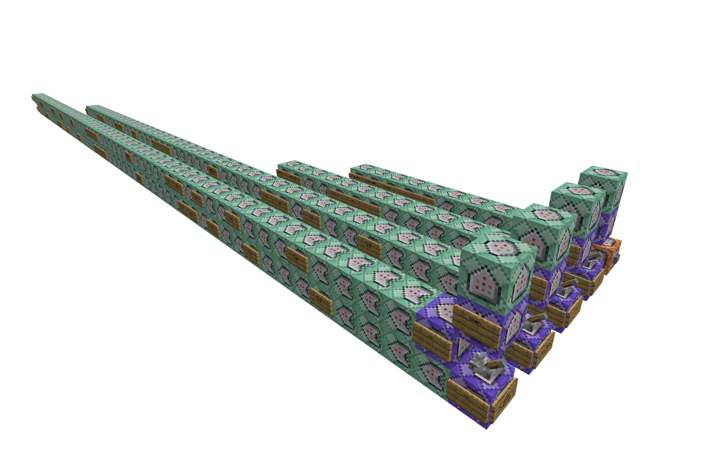                                                                                           |
| :------------------------------------------------------------------------------------------------------------------------------------------------------------------------------------------------------------------------------------------------: |
|                                                                                               <small>다항함수 계산 모듈을 이용한 그래프 구현</small>                                                                                               |
| <sub>마인크래프트 내에서 직접 코딩을 할 수 있는 커맨드 블록을 이용하여 양함수 형태의 다항함수의 식을 계산하여 그래프를 그리는 모듈이다. 오른쪽 주황색 블록부터 시작하여 그래프 초기화, 일차함수, 이차함수, 삼차함수, 사차함수순으로 구성된다</sub> |

> 각 모듈의 함수식은 다음과 같다.
>
> 일차함수: $y = ax$  
> 이차함수: $y = ax^2$  
> 삼차함수: $y = ax^3+bx^2+cx+d$  
> 사차함수: $y = ax^4+bx^3+cx^2+dx+e$
>
> 마인크래프트에는 점수판의 기능을 하는 스코어보드(Scoreboard)라는 시스템이 존재한다. 이 스코어보드를 활용하여 변수, 즉 $x, y, a, b, c, d, e$에 값을 저장할 수 있는데, 이 시스템은 **간단한 정수의 사칙연산만 가능**하다는 한계가 있어 항의 개수가 증가함에 따라 계산 횟수가 급격히 증가하여 일차함수부터 사차함수까지 모듈의 길이가 점차 길어진 모습을 볼 수 있다.
>
> 모듈이 계산을 마친 후에는 $x$값을 정의역을 $[0, \infty)$과 $(-\infty, 0)$으로 나누어 특정 간격마다 변화시키면서 함수에 대입한 후, 그 결과값인 $y$값을 아머 스탠드 위치의 $y$값에 저장하여 그 위치에 점을 찍어 그래프를 그린다.

|                                                                             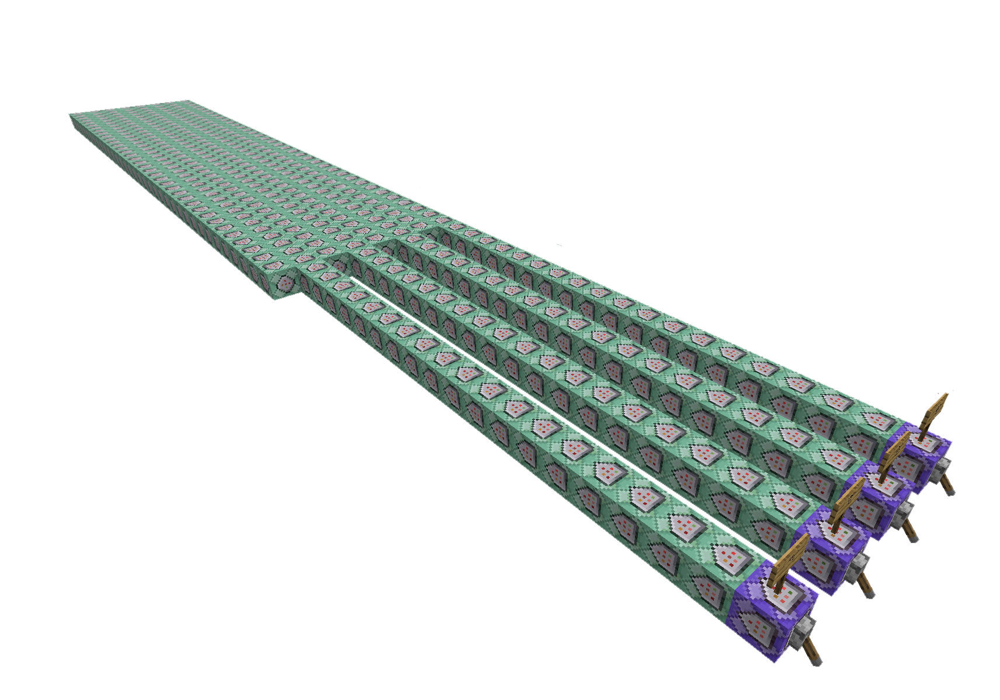                                                                              |
| :---------------------------------------------------------------------------------------------------------------------------------------------------------------------------------------------------------------: |
|                                                                               <small>각도 변환 모듈을 이용한 미분계수 적용</small>                                                                                |
| <sub>커맨드 블록을 이용하여 계산된 미분계수를 역탄젠트 함수에 대입하여 접선의 기울기를 구현하는 모듈이다. 각 정의역에서 미분계수가 양수 또는 음수인 경우를 각각 변환하기 때문에 모듈이 4개로 구성되어 있다.</sub> |

> 각도로 변환하는 이유는 다항함수 그래프 모듈이 점을 찍을 때 사용하는 아머 스탠드와 연관이 있다.
> 아머 스탠드는 머리(Head) 부분에 임의의 블록을 씌워서 나타낼 수 있는 기능이 존재한다.  
> 이때 단순히 블록을 나타낼 수 있을 뿐만 아니라 아머 스탠드의 포즈(Pose)값을 조정해줌으로써 머리의 기울임 정도를 나타낼 수도 있는데, 이때 머리를 기울이면 블록도 함께 기울어지는 원리를 이용하면 블록의 기울임 정도를 구현할 수 있다.
> | 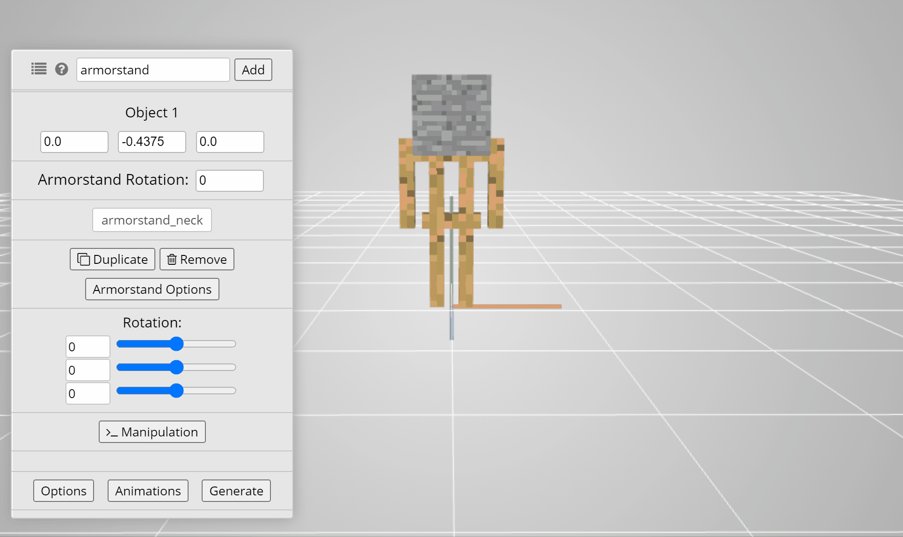 |
> |:--:|
> | <small>[아머스탠드 시뮬레이션 웹사이트](https://mrgarretto.com/armorstand)에서 아머 스탠드 머리의 포즈를 변형하는 모습. -180° ~ +180°까지 변형할 수 있다.</small>|
>
> 이 원리를 바탕으로 다항함수 그래프 모듈이 점을 찍은 다음에 각 점에서의 머리의 포즈를 변형하여 접선의 기울기를 구현할 수 있는데, 이를 마인크래프트 명령어 구현하기 위해서는 그 점에서의 **미분계수(접선의 기울기)를 각도(°)로 변환**해주어야 한다. 따라서 다항함수 $f(x)$ 위의 임의의 점 $(a, f(a))$에서의 접선의 기울기는 탄젠트($tan$)로 나타낼 수 있으므로 이를 이용하여 다음과 같은 식을 얻을 수 있다:
>
> > $tan\theta = f'(a) \ (-180° \le \theta \le 180°, -\infty < a < \infty)$
>
> 이때 필요한 값은 $\theta$의 **각도**이므로 이를 구하는 식으로 바꾸면
>
> > $A = \arctan a \times \frac{180}{\pi} \ (-\infty < a < \infty, A = (각도))$
>
> <small>*(!) 위 식에서* $arctan$*는 역탄젠트(아크탄젠트), 즉 **탄젠트의 역함수**를 말하며, 이는 아래 그림을 통해* $x$ *와* $y$*에 관한 함수로 쉽게 이해할 수 있다.*</small>
>
> 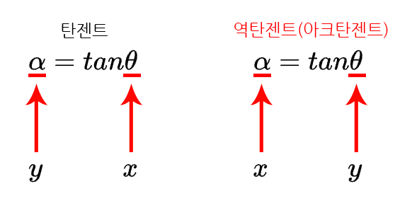
>
> <br/>
> 마인크래프트 내에서 명령어로는 위 공식을 직접 계산하는 것이 불가능하기 때문에 대신 Node.js 자바스크립트로 코딩하여 계산한 값들을 모두 마인크래프트에 저장하는 방법을 택하였다.
>
> > 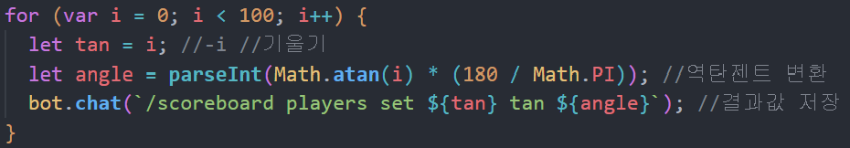
>
> -99 ~ 99까지의 미분계수에 해당하는 각도를 [마인크래프트 봇 API](https://github.com/PrismarineJS/mineflayer)를 이용하여 스코어보드에 저장하는 코드이다. 스코어보드는 **정수**만 다루기 때문에 `parseInt()`로 각도를 정수로 변환하였다. 이 때문에 정확도가 떨어지지만 근사치를 구현한다는 점에 의의를 두었다.
>
> 최종적으로 각도 변환 모듈은 -99 ~ 99까지의 미분계수에 해당하는 각도만큼 아머 스탠드 머리의 포즈를 기울여 접선의 기울기를 구현하는데, 이때 실행되는 명령어의 예시는 다음과 같다:
>
> > 정의역 $[0, \infty)$에서 임의의 점에서의 미분계수가 1인 경우,  
> > 아머 스탠드의 머리를 45° 기울인다.
>
> ```
> /execute as @e[tag=x+] at @s run execute as @e[tag=fx,sort=nearest,limit=1] at @s if score f'(x+) Coordinates matches 1 run execute store result entity @s Pose.Head[2] float 1 run scoreboard players get 1 tan
> ```
>
> > 정의역 $(-\infty, 0)$에서 임의의 점에서의 미분계수가 -8인 경우,  
> > 아머 스탠드의 머리를 -82° 기울인다.
>
> ```
> /execute as @e[tag=x-] at @s run execute as @e[tag=fx,sort=nearest,limit=1] at @s if score f'(x-) Coordinates matches -8 run execute store result entity @s Pose.Head[2] float 1 run scoreboard players get -8 tan
> ```

---

## 구현 결과

| 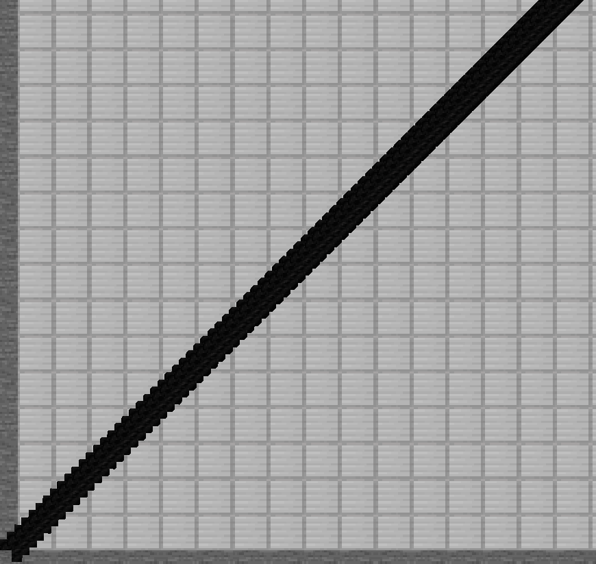    | 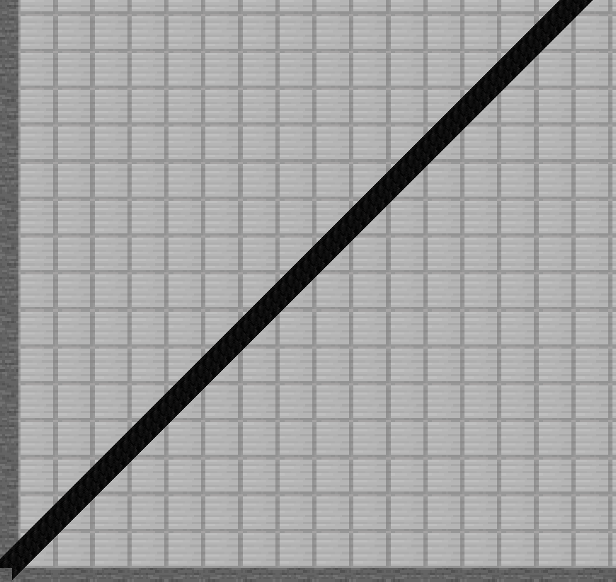 |
| ------------------------------------------------- | --------------------------------------------------- |
| <center><sup>&#119910; = &#119909;</sup></center> | <center><sup>&#119910; = &#119909;</sup></center>   |
| <center><small>미분계수 적용 전</small></center>  | <center><small>미분계수 적용 후</small></center>    |

| 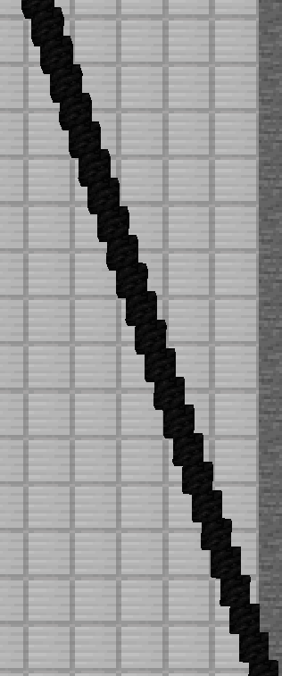  | 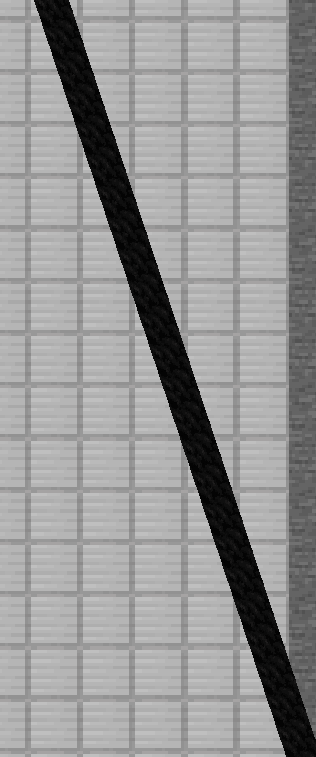 |
| --------------------------------------------------- | ------------------------------------------------------- |
| <center><sup>&#119910; = -3&#119909;</sup></center> | <center><sup>&#119910; = -3&#119909;</sup></center>     |
| <center><small>미분계수 적용 전</small></center>    | <center><small>미분계수 적용 후</small></center>        |

| 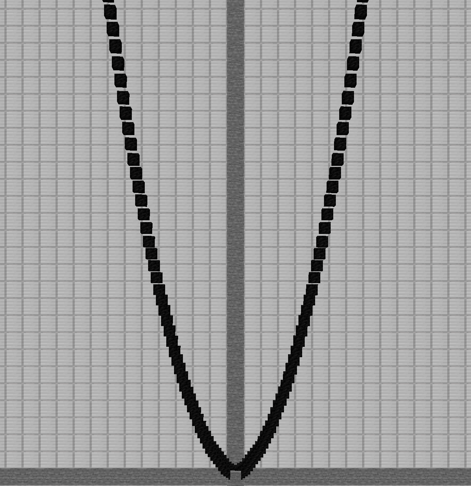       | 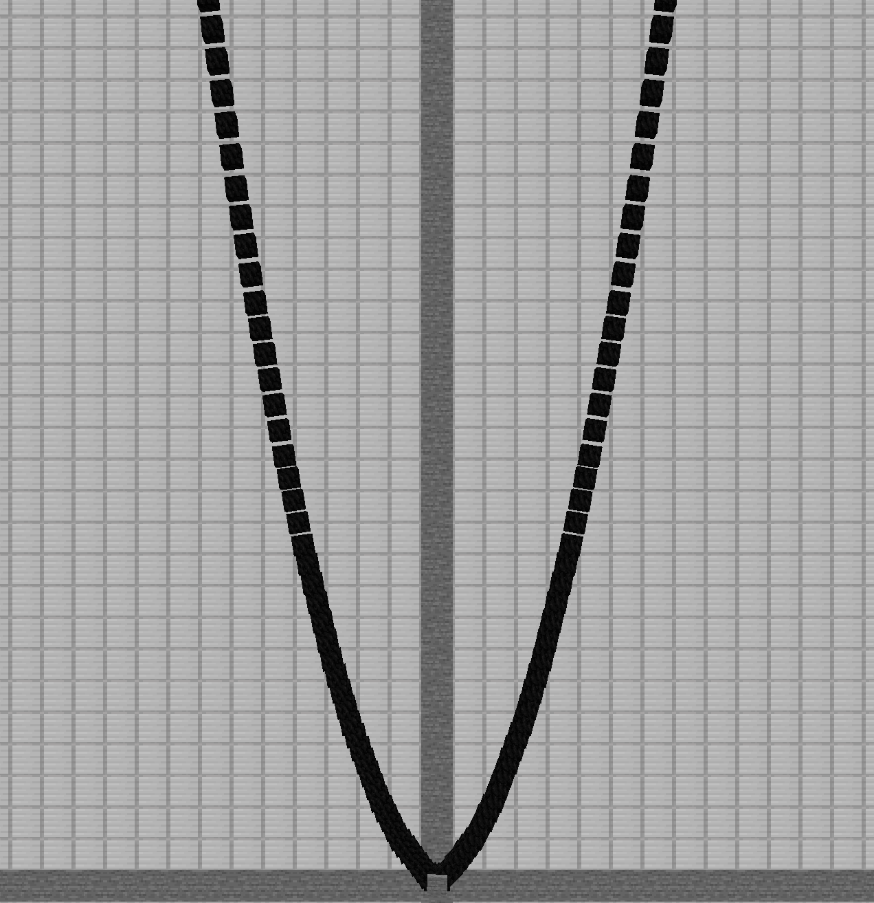  |
| ------------------------------------------------------- | ------------------------------------------------------- |
| <center><sup>&#119910; = &#119909;&#178;</sup></center> | <center><sup>&#119910; = &#119909;&#178;</sup></center> |
| <center><small>미분계수 적용 전</small></center>        | <center><small>미분계수 적용 후</small></center>        |

| 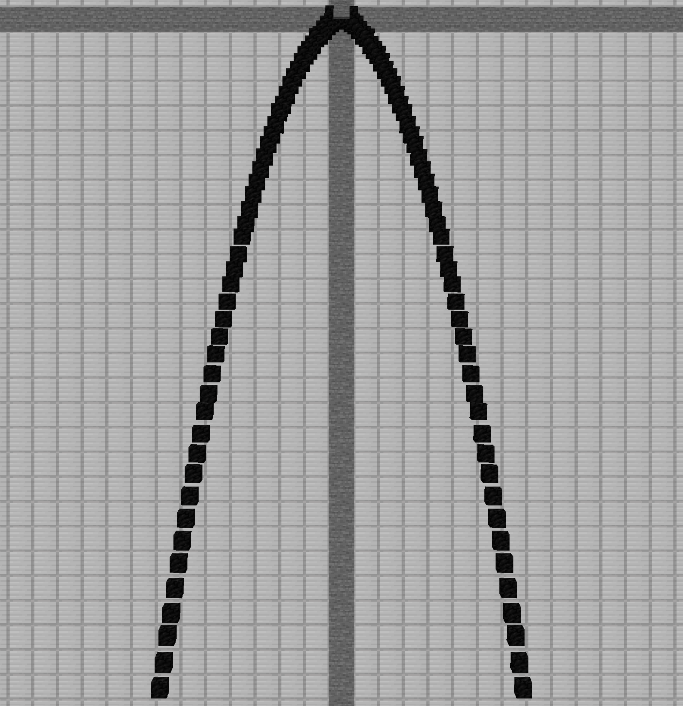      | 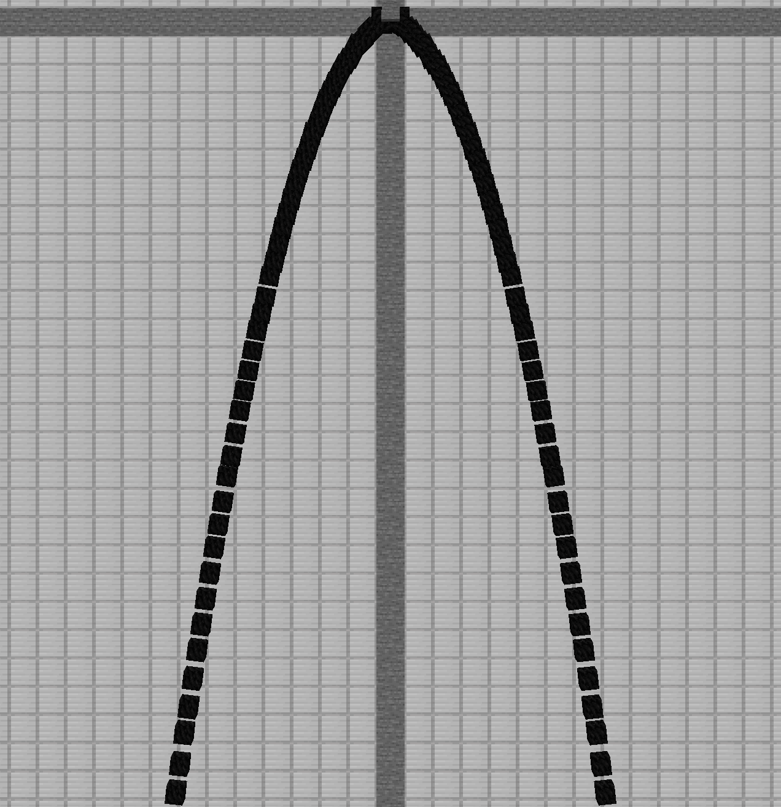 |
| -------------------------------------------------------- | -------------------------------------------------------- |
| <center><sup>&#119910; = -&#119909;&#178;</sup></center> | <center><sup>&#119910; = -&#119909;&#178;</sup></center> |
| <center><small>미분계수 적용 전</small></center>         | <center><small>미분계수 적용 후</small></center>         |

| 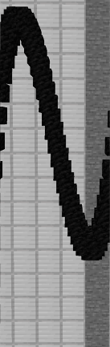                              | 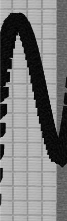                         |
| -------------------------------------------------------------------------------- | -------------------------------------------------------------------------------- |
| <center><sup>&#119910; = &#119909;&#179;+3&#119909;-8&#119909;+10</sup></center> | <center><sup>&#119910; = &#119909;&#179;+3&#119909;-8&#119909;+10</sup></center> |
| <center><small>미분계수 적용 전</small></center>                                 | <center><small>미분계수 적용 후</small></center>                                 |

| 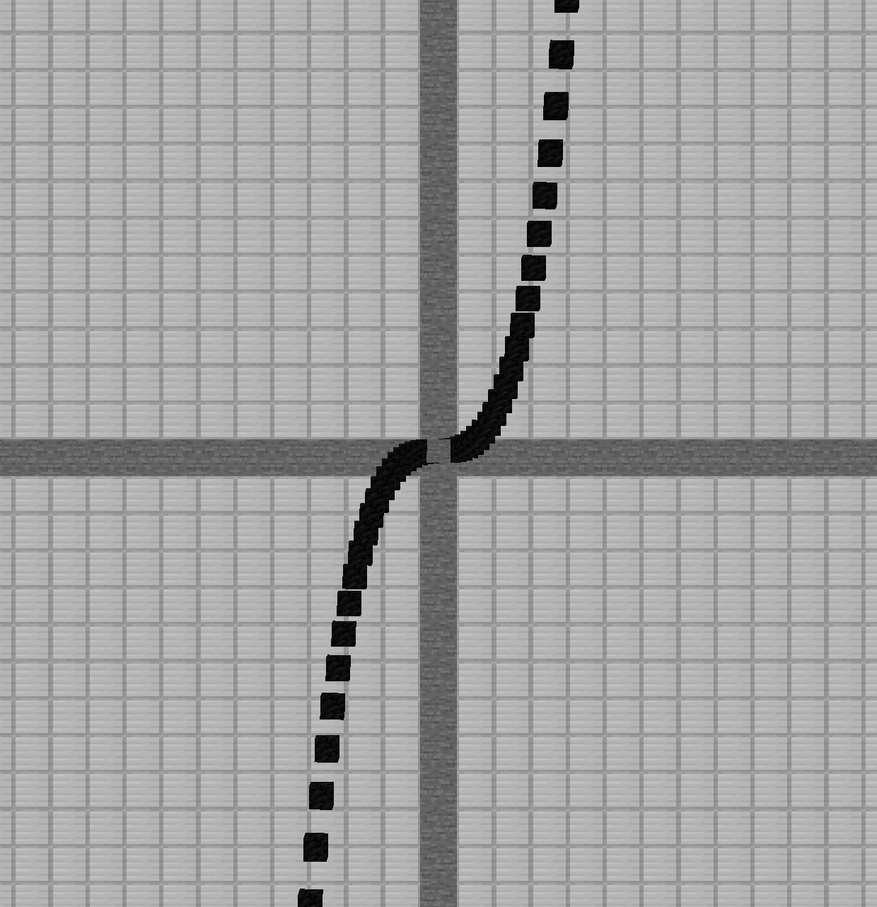       | 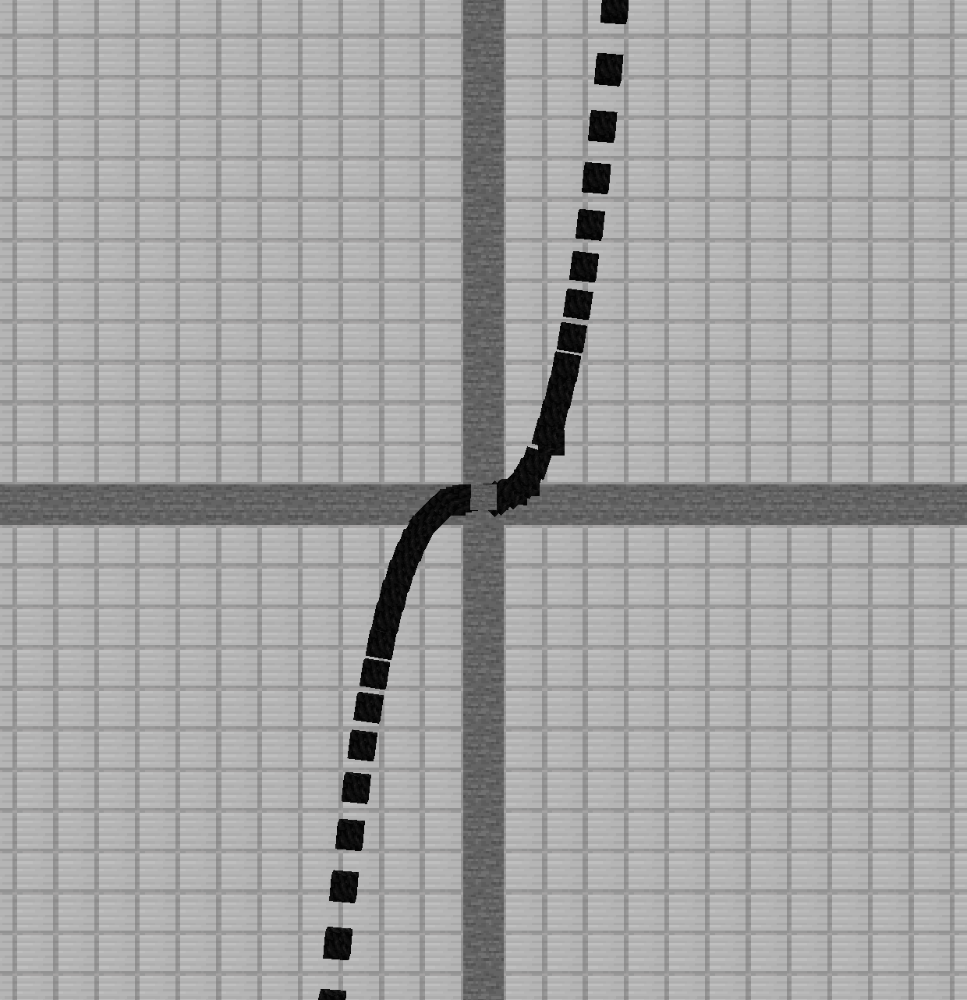  |
| ------------------------------------------------------- | ------------------------------------------------------- |
| <center><sup>&#119910; = &#119909;&#179;</sup></center> | <center><sup>&#119910; = &#119909;&#179;</sup></center> |
| <center><small>미분계수 적용 전</small></center>        | <center><small>미분계수 적용 후</small></center>        |

---

## 의의와 한계

### 의의

- $x$가 한 점으로 한없이 가까워질 때의 순간변화율(미분계수)이라는 추상적인 개념을 마인크래프트로 구현함으로써 개념을 보다 직접적으로 확인하고 이해할 수 있었음.
- 도함수의 기능을 바탕으로 기울기, 탄젠트, 각도와의 관계를 통해 접선의 기울기를 구하는 식을 유도할 수 있었음.
- 함수 그래프를 이루는 점들을 픽셀화하여 나타내려는 아이디어를 마인크래프트 게임 속 블록으로 발상을 전환하여 그래프에 더욱 쉽게 접근할 수 있었음.
- 마인크래프트 명령어와 각도 변환 모듈을 이용하여 아머 스탠드의 Pose 값을 조정하는 과정을 통해 명령어에 대한 이해도와 수학적 사고력을 높일 수 있었음.

### 한계

- #### 기하급수적으로 증가하는 함숫값에 의해 생기는 공백

  > 예를 들어
  >
  > $a_n = n^2 \ (n \ge 1)$ 일 때,  
  > $n$이 1, 2, 3, 4, $\dots$ , 12, 13, 14, 15, $\dots$ 이면  
  > $a_n$은 1, 4, 9, 16, $\dots$ , 144, 169, 196, 225, $\dots$ 이고,
  >
  > $b_n = a_n - a_{n-1} \ (n \ge 2 , \ b_1 = 1)$ 일 때,  
  > $n$이 1, 2, 3, 4, $\dots$ , 12, 13, 14, 15, 이면  
  > $b_n$이 1, 3, 5, 7, $\dots$ , 23, 25, 27, 29, $\dots$ 이므로
  >
  > $b_n$을 관찰하면 $n$이 증가함에 따라 $a_n$의 $n$항과 $(n-1)$항의 차가 계속 증가하는 모습을 볼 수 있는데, 이를 $y = x^2$의 이차함수의 관점으로 보면 **$x$값이 증가함에 따라 $y$값의 증가폭이 점점 증가**하고 있다고 해석할 수 있다.
  >
  > |           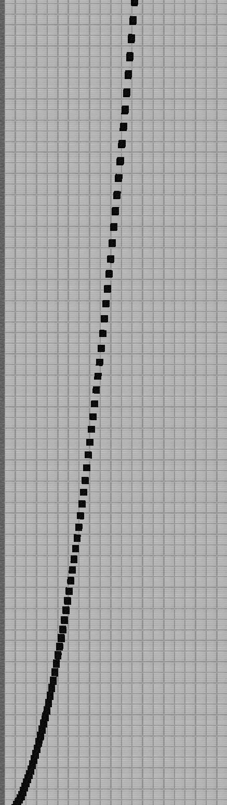            |
  > | :-----------------------------------------------------------------------------------------------: |
  > | <small>x값이 증가함에 따라 y의 값이 급격히 증가하여 공백 간격이 생기는 모습을 볼 수 있다.</small> |
  >
  > $x$값의 간격이 클 때 더 두드러지게 나타나기도 하는데, 위 그래프는 $x$값의 간격이 0.1일 때의 모습이고, $x$값의 간격을 더 줄일수록 공백을 점차 줄일 수 있지만 그래프가 촘촘해져 그래프를 그릴 때 아머 스탠드 간의 **오류**<sub><sup>(미분계수 적용 실패 등등)</sup></sub>가 생길 수 있고, 그래프의 개형을 쉽게 알아볼 수 없게 된다.
  >
  > 예시 모델)
  > | 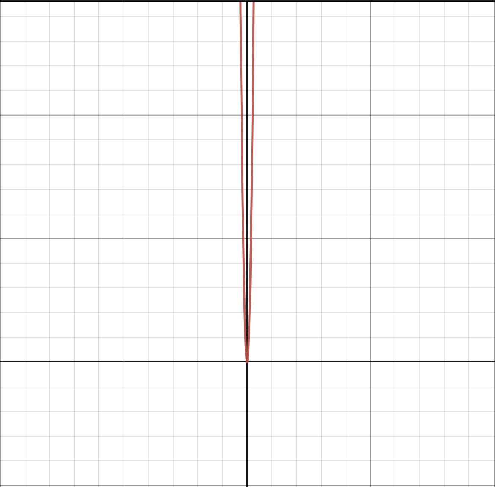 | 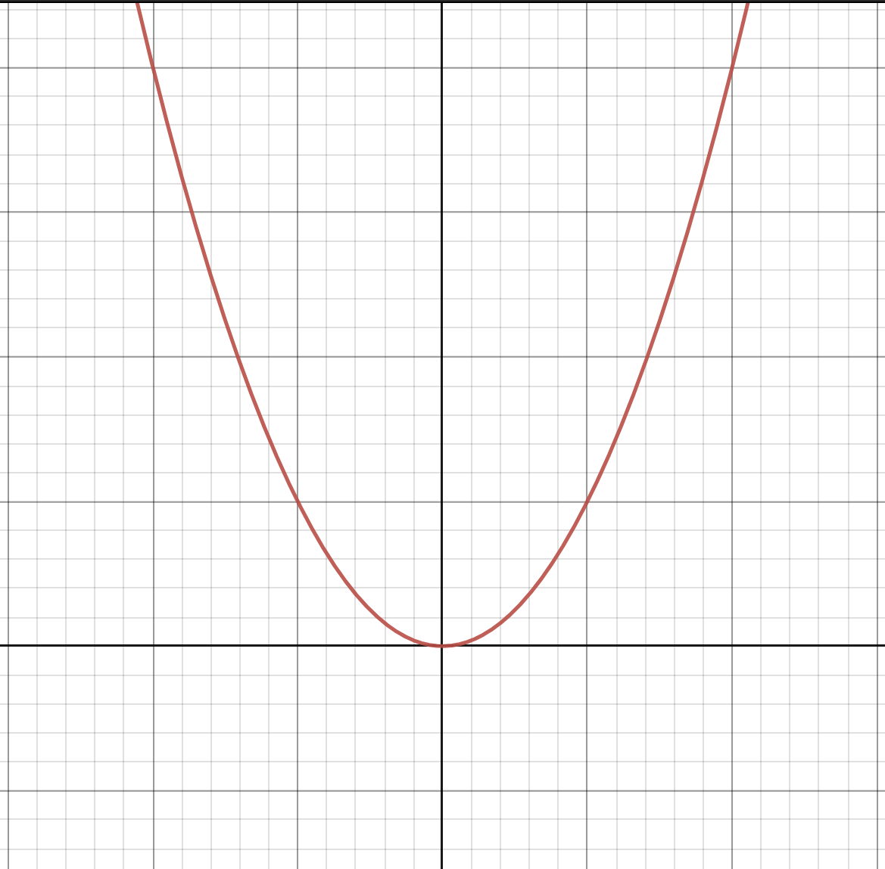 |
  > | -- | -- |
  > | <center><small>x값의 간격이 0.001일 때</small></center> | <center><small>x값의 간격이 1일 때</small></center> |
  >
  > 또한 간격을 줄일수록 생성되는 아머 스탠드의 수가 많아서 컴퓨터에 과부하가 걸릴 수 있으므로, 단순히 x값의 간격을 줄이는 것은 이 문제를 해결하기 어려워보인다.
  >
  > 이 문제에 대한 해결 방법으로 [보간법](https://www.google.com/search?q=보간법), [베지어 곡선](https://ko.wikipedia.org/wiki/베지에_곡선) 등을 연구하고 있다.

- #### 기울기 구현의 한계

  > 마인크래프트 내에서 소수점 자체가 구현이 되어있지 않다는 것이 아닌, 마인크래프트 내에서 명령어로 연산을 하려면 스코어보드를 사용해야 하는데 스코어보드는 **정수값만 지원하기 때문에 소수점 연산이 불가능**하다는 점이 그래프 구현에 있어서 꽤나 큰 문제였다. 그러나 마인크래프트 명령어 중에는 어떤 명령어 실행의 결과값을 어떤 엔티티의 [NBT 태그](https://namu.wiki/w/%EB%A7%88%EC%9D%B8%ED%81%AC%EB%9E%98%ED%94%84%ED%8A%B8/NBT)에 저장할 때 배율을 수정할 수 있는 [`execute . . . store result entity . . .` 명령어](https://namu.wiki/w/%EB%A7%88%EC%9D%B8%ED%81%AC%EB%9E%98%ED%94%84%ED%8A%B8/%EB%AA%85%EB%A0%B9%EC%96%B4/execute#s-2.3)가 있다.  
  > 예를 들어 어떤 명령어를 수행한 결과값이 10이라면, 10에 0.1배를 하여 최종값인 1을 어떤 엔티티의 NBT 태그에 저장할 수 있다.  
  > 이를 이용하여 아머 스탠드의 위치를 소수점 단위로 저장하여 그래프를 구현할 수 있었지만, 각도 변환 모듈 같은 경우에는 각도를 스코어보드에 저장해놓아야하기 때문에 소수점을 구현할 수가 없었고, 이로 인해 **접선의 기울기를 완벽히 구현해낼 수 없다**는 한계가 있다.

---

## 향후 연구 과제

- 제기된 한계점들을 보완한 새로운 구현 방식
- 함수의 극값과 연관지어 마인크래프트로 경사하강법(Gradient Descent) 구현
- . . .

---

<sub>by 허윤호 (루비)
